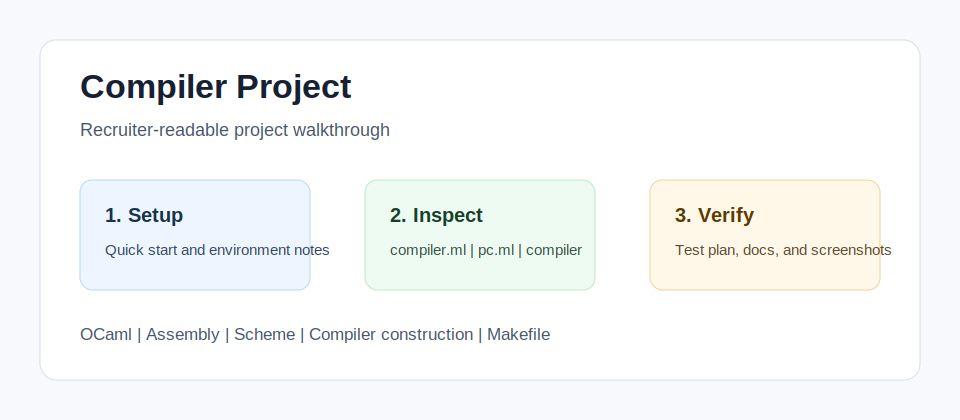

<!-- bettergithub:generated-readme -->
# Compiler Project

Compiler Project is an OCaml and Assembly implementation of a Scheme compiler with parser-combinator code, runtime support files, and test inputs. It helps reviewers inspect language-processing work: parsing, semantic transformations, code generation, runtime prologue and epilogue files, and the manual workflow used to compile and check Scheme programs.

## Tech Stack

- OCaml
- Assembly
- Scheme
- Compiler construction
- Makefile
- GitHub Actions

## Quick Start

```bash
Review compiler.ml and pc.ml.
Run make from the project root or compiler folder.
Compile a small Scheme input and compare the generated output.
```

## Usage

- Start with pc.ml for parsing helpers.
- Review compiler.ml for compiler stages.
- Use t1.scm or another small Scheme file as the manual smoke test.

## Environment Variables

No .env file or API key is required. OCaml, make, and the course compiler environment are the expected configuration.

## Demo and Screenshots



The diagram above is a lightweight walkthrough image for GitHub reviewers. It shows the reviewer path, the implementation areas to inspect, and the evidence this repository provides. For non-web course projects, this replaces a live demo with reproducible local setup and manual verification notes.

## Testing and Quality

Testing is documented even when the original assignment uses manual verification instead of a full automated suite.

```bash
Manual test: run make, compile a small Scheme file, and verify the generated assembly/runtime output.
```

See [docs/test-plan.md](docs/test-plan.md) for the manual or automated checks that should be used before presenting this repository.

## Repository Structure

- `compiler.ml`
- `pc.ml`
- `compiler`
- `testing`
- `docs`

## Architecture Notes

The compiler is kept in its original course layout. Documentation explains the major compiler stages, runtime files, and manual smoke-test workflow.

See [docs/architecture.md](docs/architecture.md) for a more detailed reviewer map.

## Recruiter Notes

- The README opens with the project purpose, audience, and result so the repository is scannable.
- Setup, environment, usage, testing, and architecture notes are collected in predictable sections.
- Existing source code was not changed by the documentation polish pass.

## Roadmap

- Add a short result screenshot or terminal capture after the project is rerun locally.
- Add one small automated smoke test if the course/tooling environment makes it practical.
- Keep the README aligned with the latest verified run command.

